# Seguridad en Microservicios

## ¿Qué es una Identity and Access Management?

un Identity and Access Management es un sistema que permite a las personas verificadas acceder a los recursos permitidos en el momento que sea solicitado. IAM viene a resolver la necesidad de garantizar el acceso adecuado a los recursos en entornos tecnológicos cada vez más heterogéneos, cumpliendo con rigurosos requisitos.

### ¿Cómo funciona el IAM?

#### Autenticación
1. El usuario provee sus credenciales, ya sea por software o hardware.
2. El IAM tiene mecanismos para verificar si las credenciales son válidas o no.
3. Por lo general, los métodos para verificar credenciales consisten en camparar resultados de funciones de hash.
#### Autorización
1. Permite integrar páginas de inicio de sesión totalmente personalizables en nuestras aplicaciones. Así como varios flujos, por ejemplo, la recuperación de contraseñas. Todo esto sin necesidad de agregar código.
2. Suponiendo que el usuario ya está autenticado, lo siguiente es verificar que dicho usuario "puede" acceder al recurso solicitado. Esta verificación se hace de manera centralizada (es decir, "X usuario tiene aceso a Y recurso") o el propio recurso puede validar quién tiene acceso a él.
3. La configuración ideal es que el acceso a los recursos (o acciones sobre los mismos) se agrupen en perfiles y estos se agrupen en roles, y los usuarios tengan asignados determinados roles. En la práctica, se aplican distintas combinaciones de la implementación anterior. Por ejemplo, que los usuarios tengan perfiles y no roles o, en algunos casos, permisos individuales.

### ¿Qué hace el IAM?

Los sistemas IAM, como base, proporcionan:

- Gestión de los usuarios: el sistema puede gestionar un repositorio propio de usuarios para crear, modificar y eliminarlos, o puede integrarse con otros repositorios y sincronizarse con ellos. Los usuarios también pueden representar a entidades no humanas, como software, dispositivos IoT o robótica.
- Roles: IAM permite agrupar usuarios según un rol para luego determinar su nivel de acceso. Por ejemplo, administradores, editores, etc.
- Autenticación: IAM autentica a un usuario al confirmar que es quien dice ser. Generalmente, se utiliza la autenticación multifactor. Esta consiste en proveer más credenciales generadas de manera distinta a fin de fortalecer la autenticación
- Autorización: la gestión de accesos garantiza que a un usuario se le otorga el nivel exacto y el tipo de acceso al que tiene derecho.
- Reportes: podemos generar reportes sobre las acciones realizadas en la plataforma, como la hora de inicio de sesión, los sistemas a los que se accede y el tipo de autenticación.
- Single sign-on (SSO): permite a los usuarios autenticarse utilizando las credenciales “federadas” en un único portal (por ejemplo: Google o Facebook). De esta manera, no es necesario que el usuario se registre nuevamente con un usuario y contraseña.
- Autenticación de múltiples factores (MFA): en una era en la que las contraseñas a menudo son robadas, el requisito de una prueba de identidad adicional es el nuevo estándar. La autenticación a través de huellas dactilares y las contraseñas de un solo uso son ejemplos de métodos de autenticación comunes.

### Clientes de reinos de Keycloak

Son las entidades que pueden solicitar a Keycloak la autenticación de un usuario. Generalmente, son aplicaciones y/o servicios que necesitan autenticar vía single sign-on.
También pueden ser entidades que requieren información del usuario autenticado previamente o un token relacionado con ellos para poder invocar a otros servicios de la solución que también usen KeyCloak.

Para crear un cliente dentro de la opción de “**Clients**” seleccionamos el ícono de “**Create**” y dentro de la opción “**Root URL**” especificamos la URL root de nuestra aplicación o servicio.

Luego debemos hacer que nuestro cliente sea de acceso confidencial para que cada API o servicio que lo requiera deba tener una clave y una contraseña como **secret** para poder acceder a estos servicios de Keycloak.Con esta opción habilitada tendremos que indicar que la característica “**Authorization Enabled**” esté habilitada.

Luego de seleccionar la opción “**Save**”, en la solapa de “**Credentials**”, podremos visualizar el secret a utilizar para conectarnos como clientes de Keycloak desde nuestro microservicio que desea autenticar a un usuario. En este caso, sería: “**jVgqbVwgkG2f9dWkEWI670uUGj4DTMo9**”.

#### Crear un usuario

Para crear un usuario, debemos ir la opción de “**Manage > Users**” y hacer clic en el botón “**Add user**”.

Completamos los datos de usuario y lo dejamos, en esta instancia, sin grupo

Luego de guardarlo, vamos a ir a la opción de “**Credentials**” para asignarle una contraseña.

**http://localhost:9091/realms/{nombre-realm}/.well-known/openid-configuration**

### Introducción a Keycloak

**¿Qué es Keycloak?** Keycloak es una herramienta de gestión de identidad y acceso de código abierto que se centra en aplicaciones modernas, como SPA (single page application), aplicaciones móviles o API REST. Se utiliza en producción para escenarios que van desde pequeños sitios web con solo un puñado de usuarios hasta grandes empresas con millones de usuarios.

#### Características de Keycloak

* Permite integrar páginas de inicio de sesión totalmente personalizables en nuestras aplicaciones. Así como varios flujos, por ejemplo, la recuperación de contraseñas. Todo esto sin necesidad de agregar código.
* Al delegar el proceso de autenticación a Keyclock, nuestras aplicaciones no necesitan preocuparse por los mecanismos de autenticación o sobre cómo almacenar las contraseñas de manera segura.
* Permite a los usuarios acceder a múltiples aplicaciones autenticándose una única vez gracias al mecanismo de autenticación conocido como single sign-on (inicio de sesión único). También permite gestionar las sesiones: tanto los usuarios finales como los administradores tienen visibilidad completa de dónde están autenticados y pueden finalizar la sesión de forma remota cuando sea necesario.
* Keycloak viene con su propia base de datos de usuarios, lo que hace que sea fácil de comenzar a utilizar.
* Permite configurar la conexión con otra base de datos, ya sea una existente o una nueva.
* Es una solución ligera y fácil de instalar. Es altamente escalable y proporciona alta disponibilidad.

### Instalación y ejecución de Keycloak

Keycloak proporciona varias opciones de instalación. Algunas de ellas son:

* Ejecutándolo como un contenedor de Docker.
* Instalándolo y ejecutándolo localmente utilizando Java.
* Ejecutándolo con Kubernetes.

Nosotros vamos a utilizar Docker para ejecutarlo, ya que consideramos que es la opción más simple.

Ejecutando Keycloak con Docker

    docker run -p 8080:8080 -e KEYCLOAK_ADMIN=admin -e KEYCLOAK_ADMIN_PASSWORD=admin quay.io/keycloak/keycloak:18.0.0 start-dev

(agregar sudo en ubuntu)

El comando de arriba nos permite ejecutar keycloak en un contenedor, en donde además indicamos que queremos exponer el puerto 8080, y configuramos las credenciales para el usuario administrador.

Listo, ahora podemos acceder a http://localhost:8080 para verificar su ejecución.

### Consola de administración

La consola de administración de Keycloak nos proporciona una interfaz para administradores y desarrolladores que quieran configurar y administrar Keycloak. Para acceder a la consola nos dirigimos a http://localhost:8080/admin/ y nos autenticamos. Una vez autenticados, podemos ver la configuración.

### Creando y configurando un realm

Un realm (o reino) es un concepto que en Keycloak refiere a un objeto que administra un conjunto de usuarios junto con sus credenciales, roles y grupos. Un usuario en Keycloak pertenece a un solo reino.
Lo primero que tenemos que hacer es crear un reino para nuestra aplicación, los reinos nos permiten utilizar el servidor de Keycloak para múltiples aplicaciones, esto nos permite por ejemplo que cada aplicación tenga la configuración y su base de datos independiente del resto.

### ¿Cómo creamos un reino?
1. Apoyando el mouse sobre “Master” aparece el botón “Add realm”.

2. Luego indicamos un nombre y clickeamos en “**Create**”.

### Exportar/Importar configuraciones en Keycloak

Al trabajar de forma local con Keycloak puede ocurrir que necesitemos guardar la configuración de nuestro reino para poder utilizarla en otra computadora o, también, en el caso de que nuestra configuración se pierda y debamos realizarla desde cero. Keycloak nos permite importar y exportar nuestras configuraciones en archivos JSON.

Para exportar vamos al submenú “Export” en el menú a la izquierda de la consola de administración. Para crear el archivo de configuración solamente tenemos que hacer clic en el botón “Export”.
Opcionalmente, podemos añadir a este archivo la configuración de clientes, roles y grupos que hayamos creado (esto puede aumentar significativamente el tamaño del archivo dependiendo de la cantidad que hayamos configurado).

Para importar tenemos dos opciones. Si tenemos que crear el reino nuevamente, podemos simplemente utilizar el archivo al hacerlo. Cuando vimos cómo crear un reino, haciendo clic en el botón “Add realm”, pudimos observar que existe la opción “Import”.
Luego, haciendo clic en “Select file” podemos buscar el archivo JSON que queremos utilizar y luego hacer clic en “Create”. El nuevo reino se creará con el mismo nombre y configuración que tenga el archivo.

La otra opción es para el caso en que hayamos creado el reino, pero necesitamos importar su configuración. Para esto, vamos al submenú “Import” en el menú a la izquierda de la consola de administración. Aquí tendremos que hacer clic en el botón “Select file”.

Buscamos el archivo JSON de configuración que queremos añadir y lo seleccionamos. Allí podremos:
* Ver el detalle del archivo haciendo clic en “View Details”.
* Limpiar la selección del archivo haciendo clic en “Clear import”.
* Podremos elegir si queremos importar los clientes, roles de cliente o roles de usuario que contenga el archivo. Entre paréntesis, podemos ver el detalle de la cantidad que posee el archivo de cada uno.
* Por último, la opción “If a resource exists”, nos permite seleccionar qué acción debe tomar Keycloak en el caso de que se esté por importar un recurso que ya exista en nuestro entorno. Tenemos tres opciones: “Fail” lanzará un error detallando que el recurso ya existe, “Skip” ignorará los conflictos que existan y “Overwrite” sobreescribirá cualquier recurso que ya exista con el que estemos importando.

Una vez seleccionadas las opciones que queremos, hacemos clic en el botón “Import” y podremos ver un detalle de los cambios que fueron realizados.

Utilizar un administrador de acceso e identidades (IAM) permite que los desarrolladores se enfoquen en las reglas de negocio, al delegar los aspectos de seguridad de la autenticación y autorización. A su vez, una herramienta como Keycloak nos brinda la seguridad de que estamos utilizando una solución probada en producción a gran escala y nos evita el riesgo de implementar una solución propia que podría eventualmente fallar.

### Ejercitemos lo aprendido

http://localhost:8080/realms/dh/protocol/openid-connect/auth?client_id=oidc-postman&response_type=code&redirect_uri=http://localhost:8082/&scope=openid

    docker-compose up

URL: http://localhost:8080/ | https://askcodes.net/coding/how-to-pass-arguments-to-entrypoint-in-docker-compose-yml

## Estándares de Autenticación y Autorización
### Introducción a estándares

***Seguridad***: Los protocolos de autenticación estandarizados han sido examinados públicamente por expertos y son de confianza. Debido a esto, muchas organizaciones confiarán en determinadas soluciones solo si se utilizan protocolos estandarizados como **OAuth, OIDC o SAML**. Cuando utilizamos un protocolo estandarizado, tenemos la tranquilidad de saber que nuestro sistema de autenticación sigue los pasos de los expertos de la industria y las mejores prácticas.

***Aprendizaje transferible***: ¿Qué pasaría si cada vez que construimos el sistema de autenticación de un nuevo sistema, tenemos que crearlo desde cero? Tendríamos que aprender los detalles esenciales de la autenticación una y otra vez. Esto conduciría a un escenario en el que no podríamos aprovechar el conocimiento ganado con tanto esfuerzo entre proyectos y empleadores. Si, en cambio, utilizamos un protocolo ubicuo (como OAuth) puede haber diferencias sutiles, pero **comprenderemos la arquitectura de autenticación general**. Si sabemos cómo funcionan los protocolos estandarizados y qué casos de uso resuelven, **podemos llevar ese conocimiento a otros proyectos y empresas**. Lo mismo se aplica al enseñar e incorporar nuevos desarrolladores al equipo. Si utilizamos un protocolo de autenticación estandarizado, es probable que los nuevos miembros del equipo ya los conozcan. Por lo que será mucho más fácil hacer que estos nuevos miembros del equipo se pongan en marcha y contribuyan a estas áreas relevantes del sistema.

***Soporte de librerías***: La mayoría de los lenguajes de programación modernos tienen bibliotecas de códigos que se integran con los protocolos de autenticación estándar, lo que **acelera nuestro trabajo de desarrollo**. Mediante el uso de un protocolo de autenticación estandarizado, nuestros clientes y consumidores de API pueden reutilizar bibliotecas de códigos comunes para el lenguaje de programación elegido.

***Interoperabilidad entre sistemas***. El uso de un protocolo de autenticación como OAuth hace que nuestro sistema sea más interoperable con otros, es decir, **se comunique de manera más sencilla con otros sistemas**. Si trabajamos con una organización empresarial más grande, nuestro sistema necesitará integrarse con otros sistemas todo el tiempo. El uso de una forma estandarizada ahorra tiempo, sobrecarga mental y costos generales. Lo mismo se aplica a los sistemas externos. Si hemos creado una API compatible con OAuth, por ejemplo, nuestros clientes comprenderán cómo integrar sus soluciones y sistemas con los nuestros mucho más rápido y con muchos menos dolores de cabeza.

***Manejo de casos límite***: Los estándares han sido utilizados por muchas organizaciones y sistemas de muchas maneras diferentes. A menudo, los casos límite se manejan o se descartan explícitamente. Al aprovechar un estándar, **obtendremos los beneficios de todo ese conocimiento y experiencia**.

### OAuth 2.0

Cuando necesitamos darle acceso a la información de nuestra cuenta de Google (o a cualquier servicio) a un sitio web o aplicación, OAuth puede ayudarnos a garantizar ese acceso de forma segura. OAuth es, probablemente, el protocolo de autenticación más popular de la industria. ¿De autenticación? Bueno, de hecho, no es un protocolo de autenticación en sí mismo, como estamos a punto de ver.
Específicamente, OAuth permite que una aplicación obtenga de forma segura un token de acceso (un poco más adelante vamos a adentrarnos en el mundo de los tokens), que puede ser usado para realizar solicitudes adicionales a API de terceros o servicios web.
Podríamos decir, básicamente, que OAuth es un estándar que define la coreografía entre clientes y servicios para garantizar la forma en que se obtiene un token para acceder a los diferentes recursos de la aplicación o sitio web.
Por supuesto, en esta coreografía hay actores que tendrán diferentes roles y jugarán papeles muy importantes en el transcurso del proceso o flujo de solicitudes y recuperación de la información.

#### Funcionamiento de OAuth 2.0

En esencia, en el flujo de protocolo OAuth, el cliente (la aplicación) solicita al servidor de autorización (el servicio) el acceso a un recurso en nombre del propietario (el usuario). El servidor de autorización emite un acceso limitado al recurso en forma de token de acceso. Tras recibir el token de acceso, el cliente puede acceder al recurso en el servidor de recursos (aquí aparece Keycloak, gestionando el proceso), incluyendo el token de acceso en la solicitud.

Ya tenemos, entonces, una comprensión un tanto básica de cómo funciona tras bambalinas el estándar de OAuth… ¿Pero no necesitamos introducirnos más a fondo hasta desenterrar todo el complicado proceso y código que esto conlleva? Bueno, no necesariamente. Lo que siempre vamos a priorizar es usar una biblioteca que oculte su complejidad y nos ayude a aplicarlo de la manera correcta… y, por supuesto, nos ahorre trabajo.

Pero después de repasar el funcionamiento, habrás notado algo raro… OAuth se dedica a conceder acceso a los recursos (para continuar usando la terminología correcta: “autorizar”), pero no hace nada respecto a la “autenticación” de los usuarios. Para cubrir este aspecto aparece OpenID Connect (OIDC), una extensión de OAuth 2.0. Veámoslo a continuación.

### OpenID Connect (OIDC)

Decíamos que OpenID Connect es una extensión de OAuth, es decir, una capa simple de identidad (es también un protocolo estándar como OAuth) que se coloca por encima y hace que la tarea de verificar la identidad de un usuario (autenticarlo) sea más sencilla. Además, obtiene información básica del perfil desde el proveedor de identidad y permite que aplicaciones de terceros puedan verificar dicha identidad del usuario final.

Digamos que, una de las características más importantes (y parte de su propósito) es proponer un solo login para múltiples sitios o aplicaciones cada vez que vayamos a loguearnos en un sitio web que use OIDC, seremos redirigidos a un sitio de OpenID donde nos loguearemos y, posteriormente, seremos llevados de vuelta al sitio web principal.

Por ejemplo, si ingresamos a un sitio y decidimos hacer login usando una cuenta de Google, entonces habremos usado OIDC. Una vez que somos autenticados exitosamente y autorizamos al sitio web o aplicación a la que estabamos tratando de ingresar para que pueda acceder a nuestra información, Google envía información al sitio web/aplicación sobre el usuario y sobre la autenticación realizada.

Esta información vuelve bajo la forma de un JWT (recibiremos un token de acceso -access token- y, probablemente, un token de identificación -ID token). Ya conocemos algo de JWT, pero vamos a ver qué papel juega exactamente en este proceso de autenticación/autorización.

Como habremos notado por el ejemplo, OIDC también sigue un flujo, y este es muy similar al de OAuth, excepto que los actores involucrados en el proceso son menos y tiene diferentes nombres:

Entonces, OIDC es de gran ayuda para cuando queremos permitir a los usuarios que se logueen en una aplicación por medio de otro servicio (los más comunes son Google, Facebook o Twitter). Históricamente, esto se hacía a través de OAuth, agregando algunas customizaciones extras. Pero OIDC nos provee de un estándar sólido para hacerlo de una manera segura y confiable.

Y ahora, repetimos una pregunta… ¿Necesitamos introducirnos a fondo hasta desenterrar todo el complicado proceso y código que OIDC conlleva? Por supuesto que no.

### Json Web Token (JWT)

Los JSON web tokens (JWT) son una forma estandarizada, compacta y autocontenida de transmitir de manera segura información entre partes. Sabemos que la J refiere a JSON y es que esa información se transmite como objetos de tipo JSON. Los JWT pueden ser verificados y confiados, ya que son firmados digitalmente (junto con la posibilidad de ser encriptados) y contienen toda la información requerida sobre una entidad, evitando tener que hacer consultas a una base de datos más de una vez. Además, quien recibe ese JWT tampoco necesita llamar a un servidor para validarlo. Pero vale la pena recalcar que, como dijimos que son un estándar, esto significa que todos los JWT son tokens, pero no todos los token son JWT.

***Beneficios de JWT***

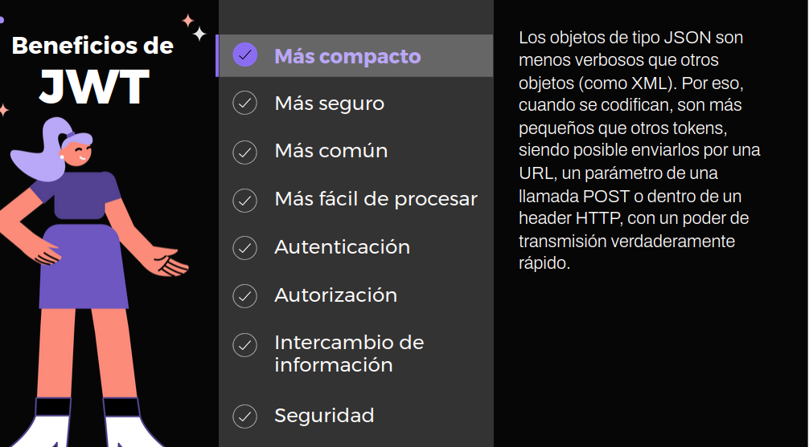
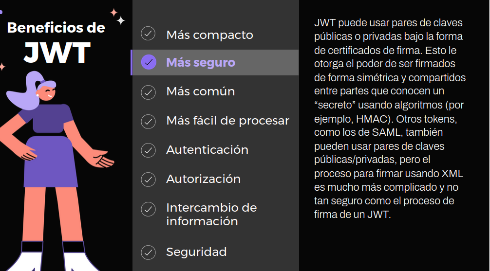
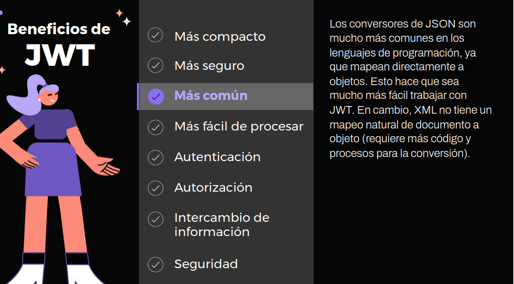
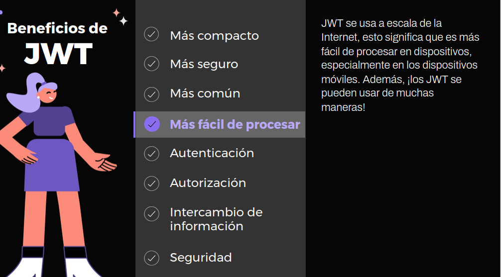
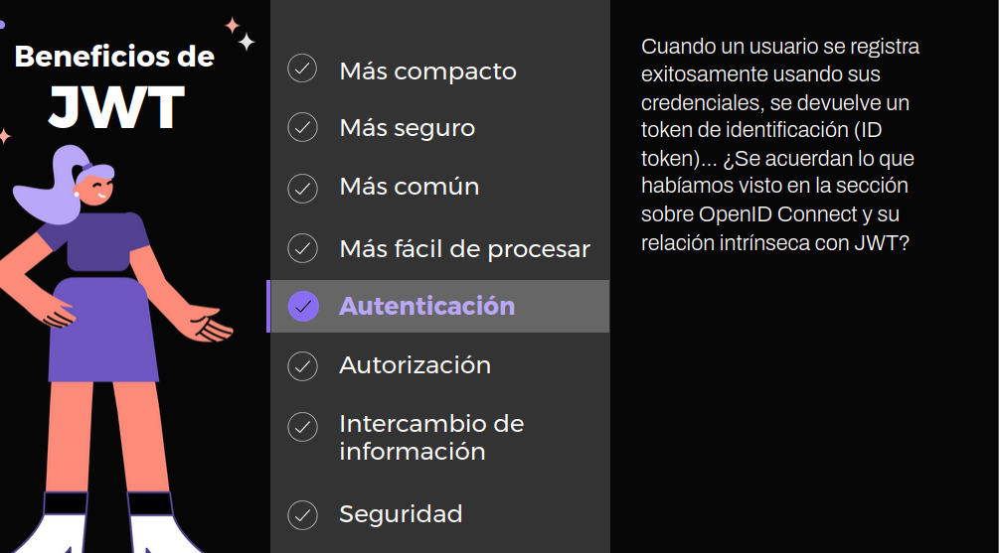
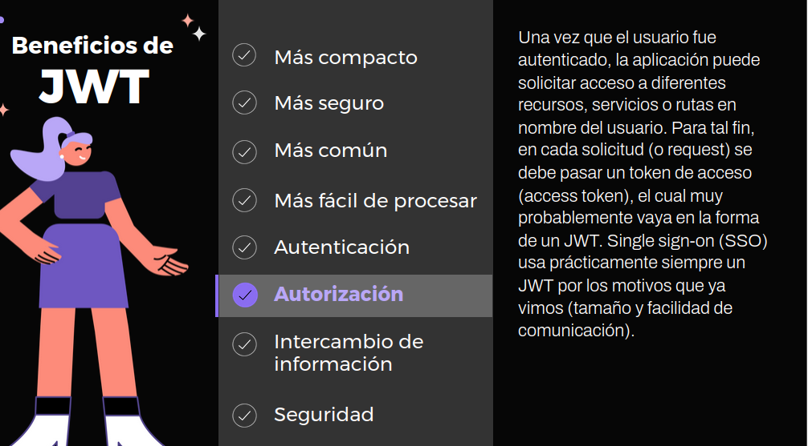
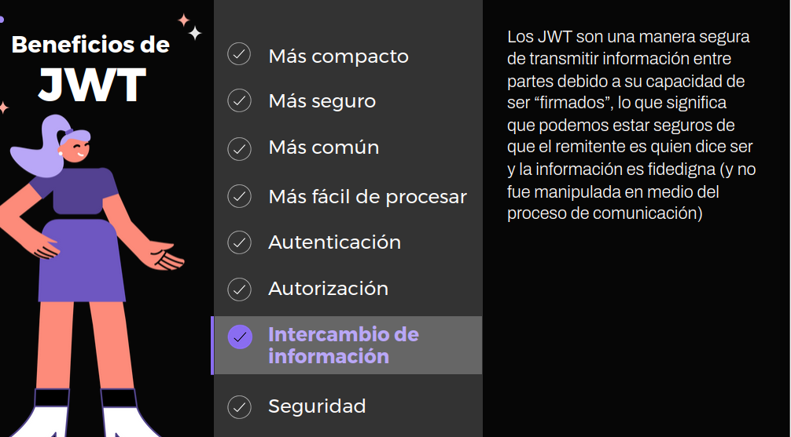
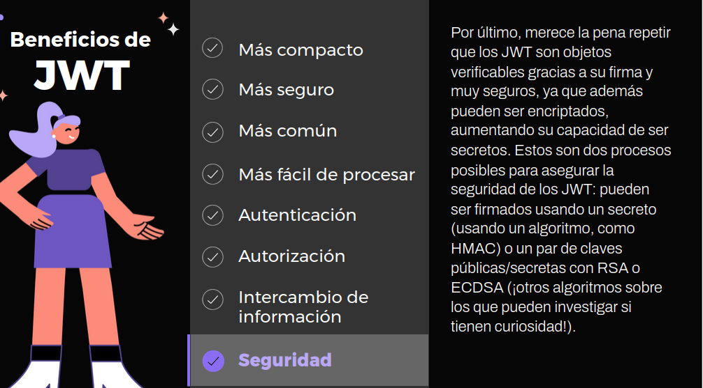

Entonces, es muy importante que, antes de usar un JWT, este sea validado de forma apropiada usando su firma. Podemos notar que un token validado con éxito asegura que la información no fue manipulada, pero no significa que no haya sido vista; por ello es muy importante nunca transmitir información sensible vía JWT y utilizar mecanismos para que no sea interceptado (por ejemplo, enviarlos por medio de HTTPS).

### OIDC Discovery

**Configuración de Keycloak**

Compartimos la configuración de Keycloak que vamos a utilizar para esta clase:

    Nombre del reino (realm): digital-house
    Client ID: oidc-postman
    Root URL: http://localhost:8080

#### OpenID Connect Discovery

Dentro de las “reglas” de OpenID, podemos destacar OpenID Connect Discovery. Esta indica que el proveedor debe ofrecer un endpoint que nos permita obtener información acerca de su configuración. El proveedor que implementa OpenID Connect, en nuestro caso, es Keycloak

**¿Cómo podemos ver esta información?**

Mediante una petición utilizando el método GET al endpoint:

    URL_HOST_KECLOAK/realms/REALM_NAME/.well-known/openid-configuration

En nuestro caso, tenemos al servidor de Keycloak ejecutándose en el puerto 8085, así que nos quedará:

    http://localhost:8085/realms/digital-house/.well-known/openid-configuration

**¿Qué información obtenemos?**

    {
        "issuer": "http://localhost:8085/realms/digital-house",  --issuer: URL de nuestro reino dentro de Keycloak.
        "authorization_endpoint": "http://localhost:8085/realms/digital-house/protocol/openid-connect/auth", --authorization_ endpoint: endpoint que se utiliza para autenticar al usuario en caso de que no esté logueado.
        "token_endpoint": "http://localhost:8085/realms/digital-house/protocol/openid-connect/token", --token_endpoint: endpoint para obtener el token.
        "introspection_endpoint": "http://localhost:8085/realms/digital-house/protocol/openid-connect/token/introspect",  --Introspection_ endpoint: endpoint para obtener información sobre un token dado.
        "userinfo_endpoint": "http://localhost:8085/realms/digital-house/protocol/openid-connect/userinfo", --userinfo_endpoint: endpoint para obtener información de un usuario.
        "end_session_endpoint": "http://localhost:8085/realms/digital-house/protocol/openid-connect/logout",
        "frontchannel_logout_session_supported": true,
        "frontchannel_logout_supported": true,
        "jwks_uri": "http://localhost:8085/realms/digital-house/protocol/openid-connect/certs",
        "check_session_iframe":
    "http://localhost:8085/realms/digital-house/protocol/openid-connect/login-status-iframe.html",
    ...
    }

**¿Para qué se usa esta información?** Esta información es utilizada por Spring Security (o cualquier otro cliente que se comunique con Keycloak) para implementar los diferentes flujos (autenticación y autorización) que especifica OpenID. Por eso es que en esta clase decidimos explicarlo utilizando solamente Postman. Si utilizamos Spring, no podríamos ver cómo es realmente la conexión entre estos dos componentes.

### Autenticación de un usuario

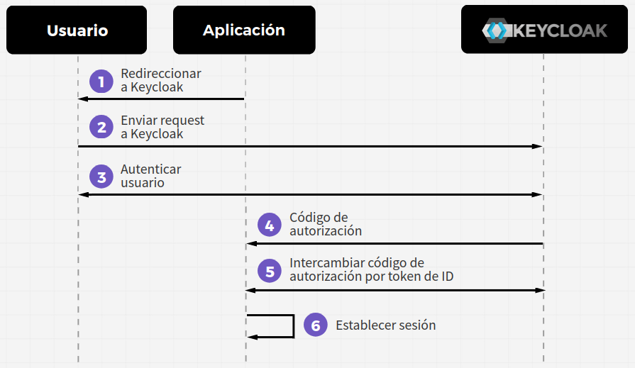

1. La aplicación prepara lo que se llama una solicitud de autenticación y pide al navegador del usuario que sea redirigido a Keycloak.
2. El navegador del usuario redirige al usuario a Keycloak en una “terminal” llamada “terminal de autorización”.
3. Si el usuario no está autentificado previamente, Keycloak lo autentifica.
4. La aplicación recibe un código de autorización de Keycloak en forma de respuesta de autenticación.
5. La aplicación intercambia el código de autorización por un token de identificación y un token de acceso, a través de una solicitud de token a la terminal de token en Keycloak.
6. La aplicación tiene ahora el token de identificación que puede ser utilizado para descubrir la identidad del usuario y puede establecer una sesión autenticada para el usuario.

#### Flujo de autenticación de OpenID Connect

Si nos fijamos en la respuesta de la consulta al siguiente endpoint:

    http://localhost:8085/realms/digital-house/.well-known/openid-configuration

Podemos ver el campo authorization_endpoint. Ahora utilizaremos esa URL para crear el request de autenticación, que luego nos redirigirá a Keycloak para ingresar las credenciales del usuario.

Nos debería quedar de la siguiente manera:

    http://localhost:8085/realms/digital-house/protocol/openid-connect/auth?client_id=oidc-postman&response_type=code&redirect_uri=http://localhost:8080/&scope=openid

En la URL, podemos notar una serie de parámetros:

* client_id: el ID del cliente que creamos en Keycloak.

* response_type: indica que queremos que nos retorne un código (este código luego lo usamos para cambiarlo por un token).

* redirect_uri: en un caso real, esta URL debería ser la de nuestra aplicación front-end, en nuestro caso, es solo a modo de ejemplo.

* scope: los scopes se utilizan para especificar qué tipo de acceso solicitamos cuando realizamos una petición. Sin embargo, en este caso, al pasarle el valor de openid, estamos indicando a Keycloak que estamos realizando un request de OpenID Connect.

Al abrir la URL en el navegador, podemos ver que somos redirigidos a la pantalla de inicio de sesión de Keycloak. Luego de ingresar un usuario y contraseña válidos, Keycloak nos retorna el código que le solicitamos. Este código lo podemos tomar de la URL a la que nos redirige. En nuestro caso es:

    http://localhost:8080/?session_state=7e04cd1c-780c-41d4-bb44-a6b1d0746876&code=1f381d5e-46da-4942-b204-cc64fdbca4fe.7e04cd1c-780c-41d4-bb44-a6b1d0746876.dcddbad9-696a-4b1a-a070-6af5c14a586f

En donde el valor de code es el código que nos interesa tomar, para intercambiar por un token.

##### Obteniendo el token de un usuario autenticado

Si volvemos a  la respuesta de la consulta al endpoint http://localhost:8085/realms/digital-house/.well-known/openid-configuration, podemos ver el campo token_endpoint, que tiene la URL que necesitamos para conseguir el token del usuario autenticado. Desde Postman enviamos el siguiente request:

Y obtenemos:

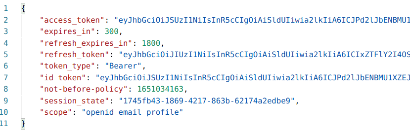

Si obtenemos algún error de tipo invalid_grant, puede ser debido a las siguientes razones:

* Realizamos la petición para obtener el token demasiado lento. El código de autorización solo es válido durante 1 minuto. Tendremos que reintentarlo más rápido.

* Enviamos la misma petición más de una vez. El código de autorización es válido para usar una única vez.

### Análisis de un ID token

En la consulta anterior obtuvimos —en la respuesta— un campo llamado id_token, cuyo valor es un JWT que contiene la información del usuario autenticado. Si copiamos el id_token y lo pegamos en https://jwt.io/ para decodificarlo y ver su información, nos muestra algo como lo siguiente:

    {
      "exp": 1651579706,    -- exp: Fecha de expiración del token.
      "iat": 1651579406,    -- Iat: Fecha de creación del token.
      "auth_time": 1651579398,  -- aut_time: Fecha de la última autenticación del usuario.
      "jti": "20909551-494f-4146-99a7-da06d9d8ae23",    -- jti: ID del token.
      "iss": "http://localhost:8085/realms/digital-house",
      "aud": "oidc-postman",    --aud: ID del cliente.
      "sub": "b222d389-9e51-44ec-96dc-ea3f7a6a27be",    -- sub: ID del usuario. Es recomendado utilizar este ID en las bases de datos en lugar de username o email, ya que estos pueden cambiar.
      "typ": "ID",
      "azp": "oidc-postman",
      "session_state": "a91cf7c1-0fc7-4fb7-a092-00fcb9b207f7",
      "at_hash": "abDTBzH0X4UtqW4dbbHjUQ",
      "acr": "1",
      "sid": "a91cf7c1-0fc7-4fb7-a092-00fcb9b207f7",
      "email_verified": true,
      "name": "Tomas Pereyra",
      "preferred_username": "tomas",
      "given_name": "Tomas",
      "family_name": "Pereyra",
      "email": "pereyratomas18@gmail.com"
    }

Las fechas en los JWT están representadas en segundos desde el 1 de enero de 1970. Si queremos averiguar la fecha de algún campo, podemos utilizar la página www.epochconverter.com.

### Refresh token

Generalmente, el ID token tiene una corta duración. Luego de unos pocos minutos, vence. Para obtener un nuevo token tenemos que enviar el refresh_token al mismo endpoint que enviamos el code autenticamos un usuario.

**Ejemplo de request:**

Ahora, en lugar de pasar el valor “code” para la key grant_type, le pasamos “refresh_token”. La respuesta nos envía el nuevo id_token y un nuevo refresh_token, ya que solamente lo podemos usar una única vez.

### Modificación del perfil de usuario

Para agregar atributos a los usuarios, vamos al Panel de administración > Users y hacemos clic en el usuario que queremos modificar. Luego, ingresamos en la solapa Attributes. En nuestro caso, vamos a agregar un nuevo atributo llamado “nacionalidad”.

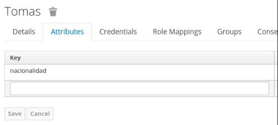

Para agregar este campo al token tenemos que crear un nuevo client scope. Este nos permitirá mapear los atributos del usuario en el token. Para crearlo vamos a Client Scopes en el menú de la izquierda y hacemos clic en Create. En nuestro caso, le vamos a poner de nombre “userScope” y guardamos

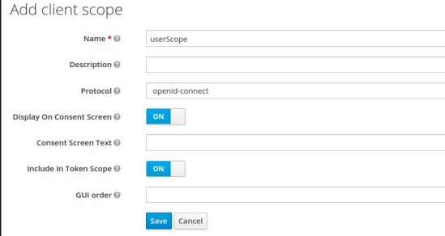

Ahora, dentro del detalle del client scope creado, hacemos clic en Mappers y creamos un nuevo Mapper con las siguientes características:

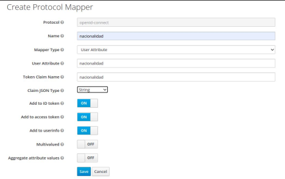

Como último paso, tenemos que agregar el client scope creado a nuestro cliente creado al comienzo de la clase. En el menú de la izquierda, hacemos clic en Clients y buscamos el cliente creado, en nuestro caso, oidc-postman. Entramos al detalle y seleccionamos Clients Scopes.

En la sección de scopes opcionales, agregamos el scope creado anteriormente. Como agregamos este scope como opcional, significa que el cliente deberá solicitarlo explícitamente.

Para comprobar que este nuevo atributo se esté agregando en el ID token, tenemos que volver a enviar la petición de autenticación, pero —en el campo scope— tenemos que agregar el scope creado. Por lo tanto, en nuestro caso, nos quedaría: scope: openid userScope.

### Agregar roles al ID token

Por defecto, los roles no se agregan al ID token. Si queremos agregarlos para hacer validaciones o simplemente leer la información, podemos hacerlo fácilmente de la siguiente forma:

    1- Debemos hacer clic en Client Scopes en el menú de la izquierda y luego ingresar a Roles

    2- Establecer en ON la opción Include in Token Scope

    3- De esta manera, podremos ver el rol del usuario desde el ID token (por ejemplo, copiando el access token y decodificándolo como ya vimos previamente con la herramienta www.jwt.io)

***Logout***

El proceso de cerrar una sesión consiste, simplemente, en invalidar todos los tokens de un usuario. Para hacer esto:

    1- La aplicación (es decir, nosotros que estamos probando) enviará una petición al endpoint end_session_endpoint (podemos ver la URL en el JSON de resultado donde se listan todos los endpoints, el endpoint del Discovery)

    2- Además, debemos agregar como query param el id_token del usuario autenticado (el id_token podemos encontrarlo en el resultado del endpoint openid-connect/token)

    3- Keycloak recibirá la petición, avisará a los otros clientes con los que el usuario podría intentar conectarse y luego invalidará la sesión, es decir, no permitirá renovar nunca más el ID token utilizando el refresh token.

### Resumen

***

For full documentation visit [mkdocs.org](https://www.mkdocs.org).

<!-- 

## Commands

* `mkdocs new [dir-name]` - Create a new project.
* `mkdocs serve` - Start the live-reloading docs server.
* `mkdocs build` - Build the documentation site.
* `mkdocs -h` - Print help message and exit.

## Project layout

    mkdocs.yml    # The configuration file.
    docs/
        index.md  # The documentation homepage.
        ...       # Other markdown pages, images and other files.

-->