# Seguridad en Microservicios

## ¿Qué es una Identity and Access Management?

un Identity and Access Management es un sistema que permite a las personas verificadas acceder a los recursos permitidos en el momento que sea solicitado. IAM viene a resolver la necesidad de garantizar el acceso adecuado a los recursos en entornos tecnológicos cada vez más heterogéneos, cumpliendo con rigurosos requisitos.

### ¿Cómo funciona el IAM?

#### Autenticación
1. El usuario provee sus credenciales, ya sea por software o hardware.
2. El IAM tiene mecanismos para verificar si las credenciales son válidas o no.
3. Por lo general, los métodos para verificar credenciales consisten en camparar resultados de funciones de hash.
#### Autorización
1. Permite integrar páginas de inicio de sesión totalmente personalizables en nuestras aplicaciones. Así como varios flujos, por ejemplo, la recuperación de contraseñas. Todo esto sin necesidad de agregar código.
2. Suponiendo que el usuario ya está autenticado, lo siguiente es verificar que dicho usuario "puede" acceder al recurso solicitado. Esta verificación se hace de manera centralizada (es decir, "X usuario tiene aceso a Y recurso") o el propio recurso puede validar quién tiene acceso a él.
3. La configuración ideal es que el acceso a los recursos (o acciones sobre los mismos) se agrupen en perfiles y estos se agrupen en roles, y los usuarios tengan asignados determinados roles. En la práctica, se aplican distintas combinaciones de la implementación anterior. Por ejemplo, que los usuarios tengan perfiles y no roles o, en algunos casos, permisos individuales.

### ¿Qué hace el IAM?

Los sistemas IAM, como base, proporcionan:

- Gestión de los usuarios: el sistema puede gestionar un repositorio propio de usuarios para crear, modificar y eliminarlos, o puede integrarse con otros repositorios y sincronizarse con ellos. Los usuarios también pueden representar a entidades no humanas, como software, dispositivos IoT o robótica.
- Roles: IAM permite agrupar usuarios según un rol para luego determinar su nivel de acceso. Por ejemplo, administradores, editores, etc.
- Autenticación: IAM autentica a un usuario al confirmar que es quien dice ser. Generalmente, se utiliza la autenticación multifactor. Esta consiste en proveer más credenciales generadas de manera distinta a fin de fortalecer la autenticación
- Autorización: la gestión de accesos garantiza que a un usuario se le otorga el nivel exacto y el tipo de acceso al que tiene derecho.
- Reportes: podemos generar reportes sobre las acciones realizadas en la plataforma, como la hora de inicio de sesión, los sistemas a los que se accede y el tipo de autenticación.
- Single sign-on (SSO): permite a los usuarios autenticarse utilizando las credenciales “federadas” en un único portal (por ejemplo: Google o Facebook). De esta manera, no es necesario que el usuario se registre nuevamente con un usuario y contraseña.
- Autenticación de múltiples factores (MFA): en una era en la que las contraseñas a menudo son robadas, el requisito de una prueba de identidad adicional es el nuevo estándar. La autenticación a través de huellas dactilares y las contraseñas de un solo uso son ejemplos de métodos de autenticación comunes.

### Clientes de reinos de Keycloak

Son las entidades que pueden solicitar a Keycloak la autenticación de un usuario. Generalmente, son aplicaciones y/o servicios que necesitan autenticar vía single sign-on.
También pueden ser entidades que requieren información del usuario autenticado previamente o un token relacionado con ellos para poder invocar a otros servicios de la solución que también usen KeyCloak.

Para crear un cliente dentro de la opción de “**Clients**” seleccionamos el ícono de “**Create**” y dentro de la opción “**Root URL**” especificamos la URL root de nuestra aplicación o servicio.

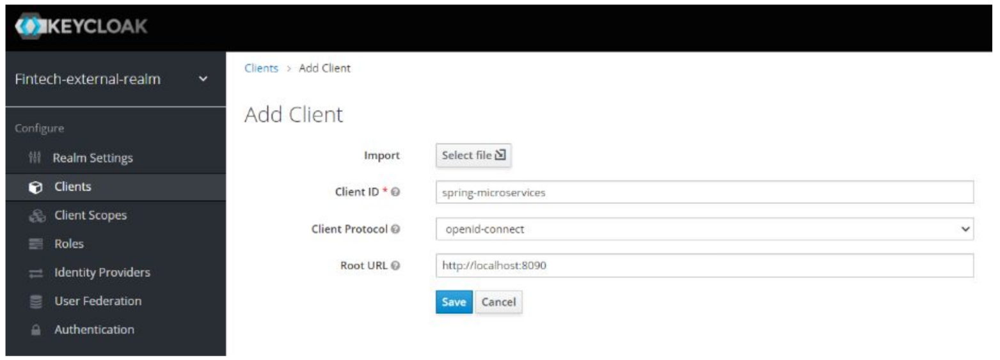

Luego debemos hacer que nuestro cliente sea de acceso confidencial para que cada API o servicio que lo requiera deba tener una clave y una contraseña como **secret** para poder acceder a estos servicios de Keycloak.Con esta opción habilitada tendremos que indicar que la característica “**Authorization Enabled**” esté habilitada.

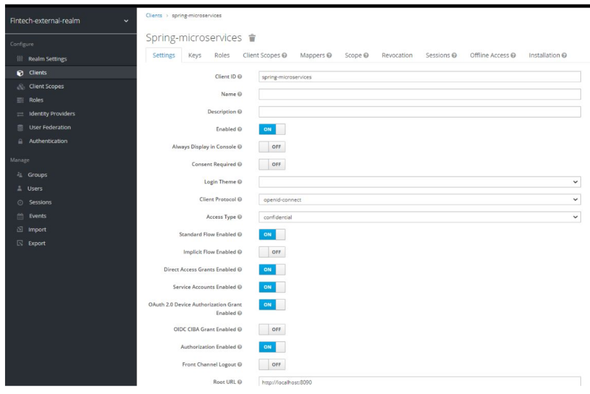

Luego de seleccionar la opción “**Save**”, en la solapa de “**Credentials**”, podremos visualizar el secret a utilizar para conectarnos como clientes de Keycloak desde nuestro microservicio que desea autenticar a un usuario. En este caso, sería: “**jVgqbVwgkG2f9dWkEWI670uUGj4DTMo9**”.

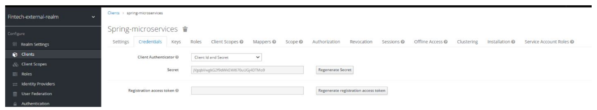

#### Crear un usuario

Para crear un usuario, debemos ir la opción de “**Manage > Users**” y hacer clic en el botón “**Add user**”.

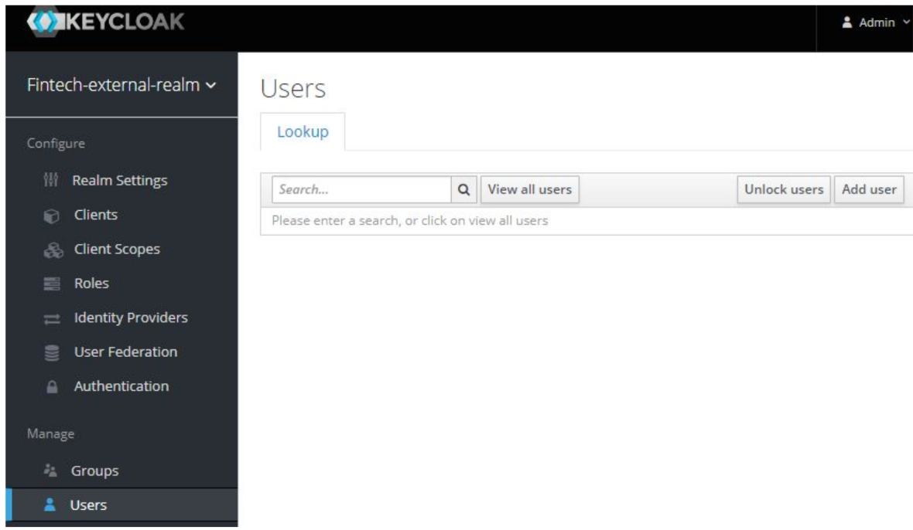

Completamos los datos de usuario y lo dejamos, en esta instancia, sin grupo

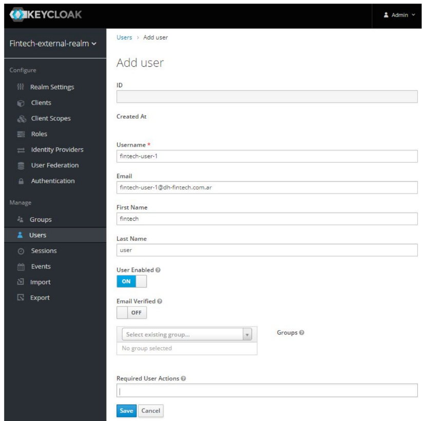

Luego de guardarlo, vamos a ir a la opción de “**Credentials**” para asignarle una contraseña.

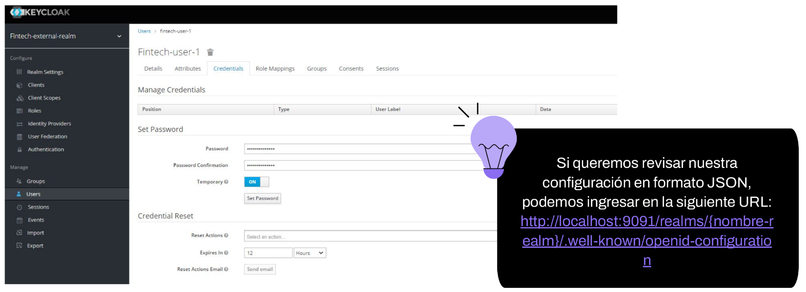

**http://localhost:9091/realms/{nombre-realm}/.well-known/openid-configuration**

### Introducción a Keycloak

**¿Qué es Keycloak?** Keycloak es una herramienta de gestión de identidad y acceso de código abierto que se centra en aplicaciones modernas, como SPA (single page application), aplicaciones móviles o API REST. Se utiliza en producción para escenarios que van desde pequeños sitios web con solo un puñado de usuarios hasta grandes empresas con millones de usuarios.

#### Características de Keycloak

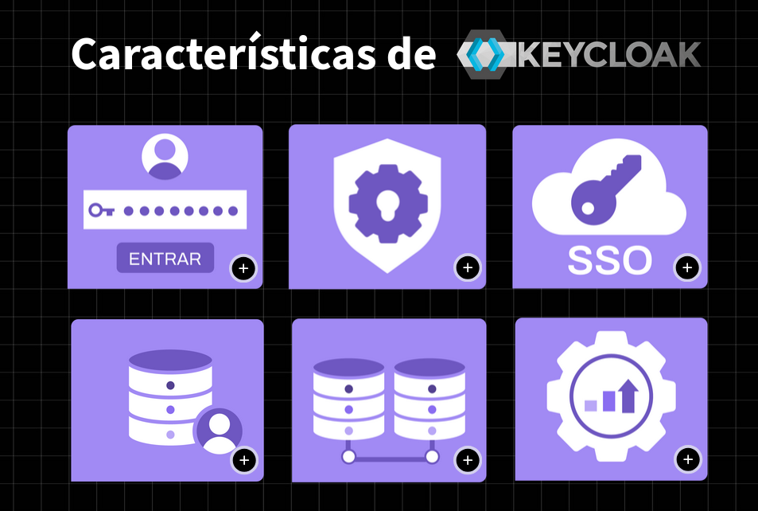

* Permite integrar páginas de inicio de sesión totalmente personalizables en nuestras aplicaciones. Así como varios flujos, por ejemplo, la recuperación de contraseñas. Todo esto sin necesidad de agregar código.
* Al delegar el proceso de autenticación a Keyclock, nuestras aplicaciones no necesitan preocuparse por los mecanismos de autenticación o sobre cómo almacenar las contraseñas de manera segura.
* Permite a los usuarios acceder a múltiples aplicaciones autenticándose una única vez gracias al mecanismo de autenticación conocido como single sign-on (inicio de sesión único). También permite gestionar las sesiones: tanto los usuarios finales como los administradores tienen visibilidad completa de dónde están autenticados y pueden finalizar la sesión de forma remota cuando sea necesario.
* Keycloak viene con su propia base de datos de usuarios, lo que hace que sea fácil de comenzar a utilizar.
* Permite configurar la conexión con otra base de datos, ya sea una existente o una nueva.
* Es una solución ligera y fácil de instalar. Es altamente escalable y proporciona alta disponibilidad.

### Instalación y ejecución de Keycloak

Keycloak proporciona varias opciones de instalación. Algunas de ellas son:

* Ejecutándolo como un contenedor de Docker.
* Instalándolo y ejecutándolo localmente utilizando Java.
* Ejecutándolo con Kubernetes.

Nosotros vamos a utilizar Docker para ejecutarlo, ya que consideramos que es la opción más simple.

Ejecutando Keycloak con Docker

    docker run -p 8080:8080 -e KEYCLOAK_ADMIN=admin -e KEYCLOAK_ADMIN_PASSWORD=admin quay.io/keycloak/keycloak:18.0.0 start-dev

(agregar sudo en ubuntu)

El comando de arriba nos permite ejecutar keycloak en un contenedor, en donde además indicamos que queremos exponer el puerto 8080, y configuramos las credenciales para el usuario administrador.

Listo, ahora podemos acceder a http://localhost:8080 para verificar su ejecución.

### Consola de administración

La consola de administración de Keycloak nos proporciona una interfaz para administradores y desarrolladores que quieran configurar y administrar Keycloak. Para acceder a la consola nos dirigimos a http://localhost:8080/admin/ y nos autenticamos. Una vez autenticados, podemos ver la configuración.

### Creando y configurando un realm

Un realm (o reino) es un concepto que en Keycloak refiere a un objeto que administra un conjunto de usuarios junto con sus credenciales, roles y grupos. Un usuario en Keycloak pertenece a un solo reino.
Lo primero que tenemos que hacer es crear un reino para nuestra aplicación, los reinos nos permiten utilizar el servidor de Keycloak para múltiples aplicaciones, esto nos permite por ejemplo que cada aplicación tenga la configuración y su base de datos independiente del resto.

### ¿Cómo creamos un reino?
1. Apoyando el mouse sobre “Master” aparece el botón “Add realm”.

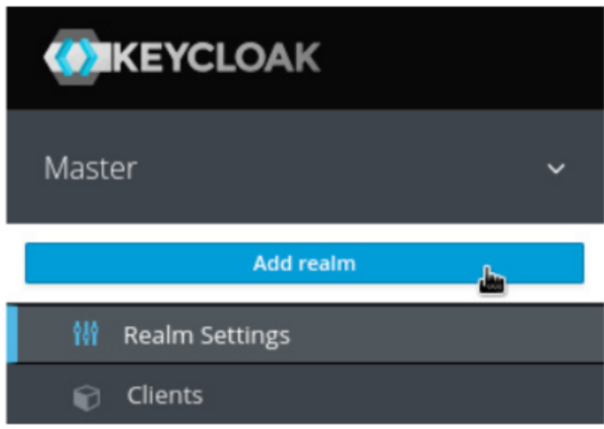

2. Luego indicamos un nombre y clickeamos en “**Create**”.

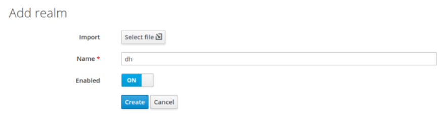

### Exportar/Importar configuraciones en Keycloak

Al trabajar de forma local con Keycloak puede ocurrir que necesitemos guardar la configuración de nuestro reino para poder utilizarla en otra computadora o, también, en el caso de que nuestra configuración se pierda y debamos realizarla desde cero. Keycloak nos permite importar y exportar nuestras configuraciones en archivos JSON.

Para exportar vamos al submenú “Export” en el menú a la izquierda de la consola de administración. Para crear el archivo de configuración solamente tenemos que hacer clic en el botón “Export”.
Opcionalmente, podemos añadir a este archivo la configuración de clientes, roles y grupos que hayamos creado (esto puede aumentar significativamente el tamaño del archivo dependiendo de la cantidad que hayamos configurado).

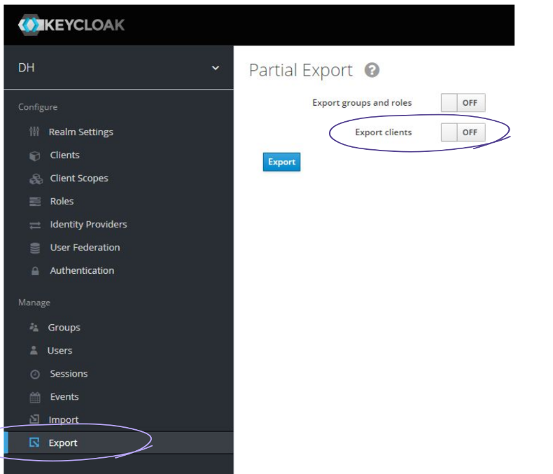

Para importar tenemos dos opciones. Si tenemos que crear el reino nuevamente, podemos simplemente utilizar el archivo al hacerlo. Cuando vimos cómo crear un reino, haciendo clic en el botón “Add realm”, pudimos observar que existe la opción “Import”.
Luego, haciendo clic en “Select file” podemos buscar el archivo JSON que queremos utilizar y luego hacer clic en “Create”. El nuevo reino se creará con el mismo nombre y configuración que tenga el archivo.

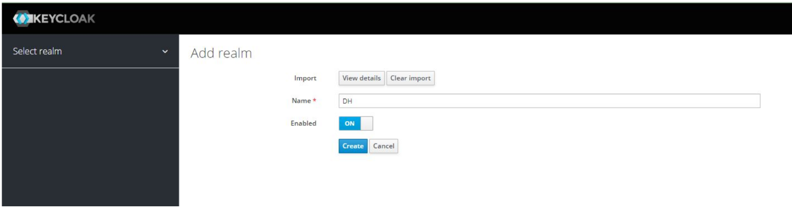

La otra opción es para el caso en que hayamos creado el reino, pero necesitamos importar su configuración. Para esto, vamos al submenú “Import” en el menú a la izquierda de la consola de administración. Aquí tendremos que hacer clic en el botón “Select file”.

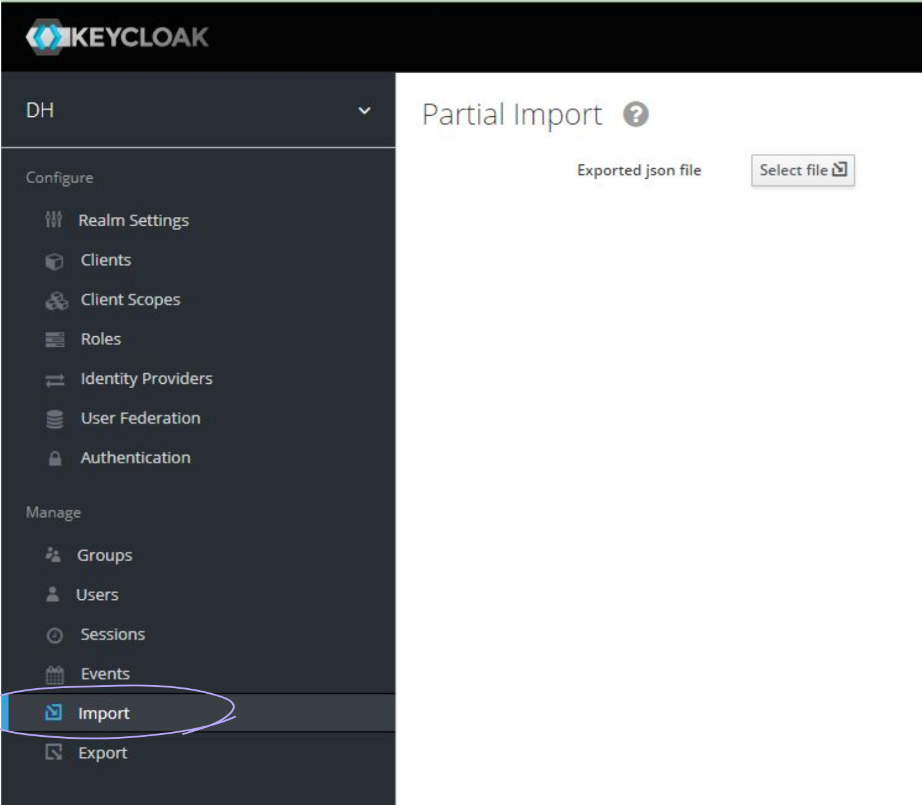

Buscamos el archivo JSON de configuración que queremos añadir y lo seleccionamos. Allí podremos:
* Ver el detalle del archivo haciendo clic en “View Details”.
* Limpiar la selección del archivo haciendo clic en “Clear import”.
* Podremos elegir si queremos importar los clientes, roles de cliente o roles de usuario que contenga el archivo. Entre paréntesis, podemos ver el detalle de la cantidad que posee el archivo de cada uno.
* Por último, la opción “If a resource exists”, nos permite seleccionar qué acción debe tomar Keycloak en el caso de que se esté por importar un recurso que ya exista en nuestro entorno. Tenemos tres opciones: “Fail” lanzará un error detallando que el recurso ya existe, “Skip” ignorará los conflictos que existan y “Overwrite” sobreescribirá cualquier recurso que ya exista con el que estemos importando.

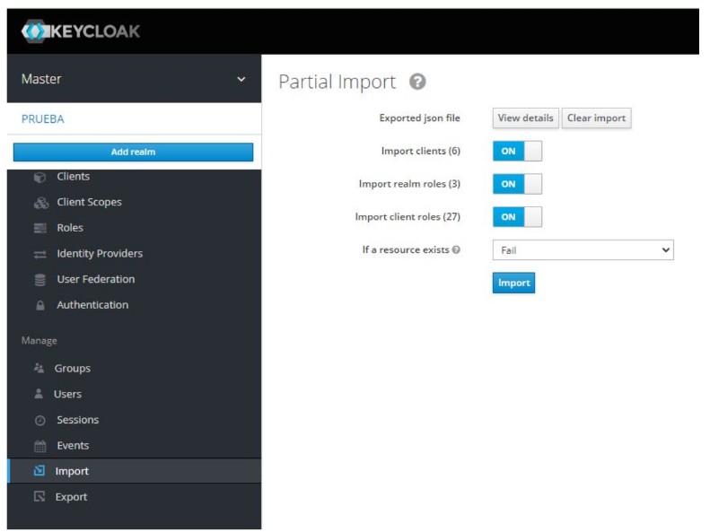

Una vez seleccionadas las opciones que queremos, hacemos clic en el botón “Import” y podremos ver un detalle de los cambios que fueron realizados.

Utilizar un administrador de acceso e identidades (IAM) permite que los desarrolladores se enfoquen en las reglas de negocio, al delegar los aspectos de seguridad de la autenticación y autorización. A su vez, una herramienta como Keycloak nos brinda la seguridad de que estamos utilizando una solución probada en producción a gran escala y nos evita el riesgo de implementar una solución propia que podría eventualmente fallar.

### Ejercitemos lo aprendido

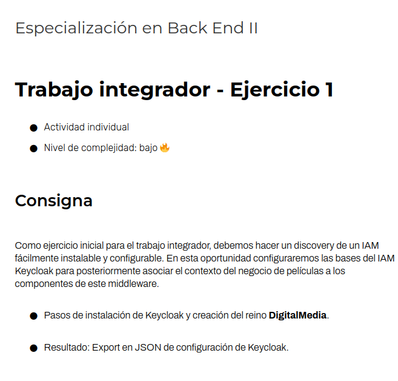

http://localhost:8080/realms/dh/protocol/openid-connect/auth?client_id=oidc-postman&response_type=code&redirect_uri=http://localhost:8082/&scope=openid

    docker-compose up

URL: http://localhost:8080/ | https://askcodes.net/coding/how-to-pass-arguments-to-entrypoint-in-docker-compose-yml

## Estándares de Autenticación y Autorización
### Introducción a estándares
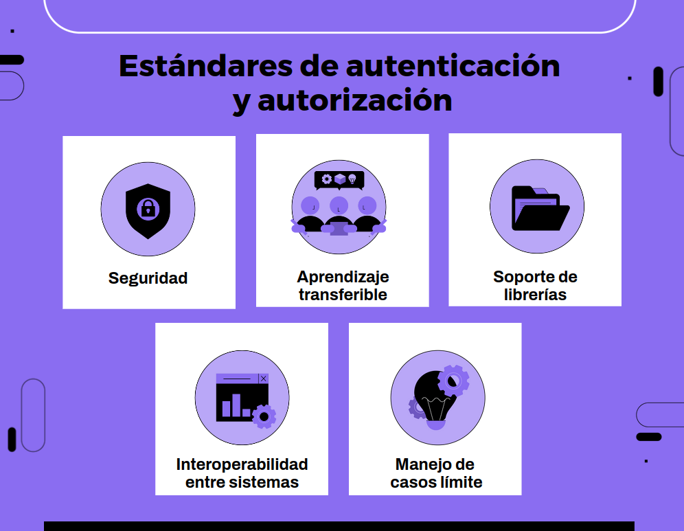

### OAuth 2.0
### OpenID Connect (OIDC)
### Json Web Token (JWT)
### OIDC Discovery
### Autenticación de un usuario
### Análisis de un ID token
### Refresh token
### Modificación del perfil de usuario
### Agregar roles al ID token
### Resumen

***

For full documentation visit [mkdocs.org](https://www.mkdocs.org).

<!-- 

## Commands

* `mkdocs new [dir-name]` - Create a new project.
* `mkdocs serve` - Start the live-reloading docs server.
* `mkdocs build` - Build the documentation site.
* `mkdocs -h` - Print help message and exit.

## Project layout

    mkdocs.yml    # The configuration file.
    docs/
        index.md  # The documentation homepage.
        ...       # Other markdown pages, images and other files.

-->